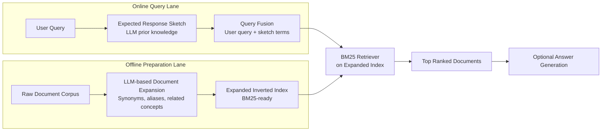
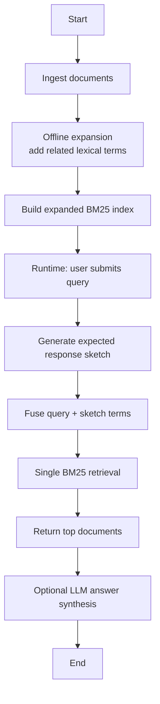

# SIRA: Super Intelligent Retrieval Agent

[](./README.md)
[](./README.md)
[](./README.md)

A retrieval architecture pattern designed to improve first-pass lexical relevance while reducing runtime latency.

Core strategy:
- Offline document expansion to enrich lexical coverage.
- Online expected response sketching to improve query intent representation.
- One-shot BM25 retrieval to avoid iterative search loops.

## Table of Contents
- [Executive Summary](#executive-summary)
- [Overview](#overview)
- [Problem Statement](#problem-statement)
- [Core Approach](#core-approach)
- [Design Principles](#design-principles)
- [Architecture](#architecture)
- [Runtime Flow](#runtime-flow)
- [Why SIRA Works](#why-sira-works)
- [Limitations and Risks](#limitations-and-risks)
- [Practical Interpretation](#practical-interpretation)
- [When to Use SIRA](#when-to-use-sira)
- [Diagram Rendering in VS Code](#diagram-rendering-in-vs-code)
- [Repository Structure](#repository-structure)
- [Related Demo App](#related-demo-app)

## Executive Summary
| Dimension | SIRA Position |
|---|---|
| Primary Goal | Improve first-pass lexical retrieval quality |
| Runtime Strategy | Single-pass BM25 retrieval |
| Offline Strategy | LLM-assisted expansion of document terminology |
| Benefit | Lower online latency vs iterative agentic retrieval loops |
| Tradeoff | Higher preprocessing and refresh overhead |

## Overview
SIRA (Super Intelligent Retrieval Agent) is a retrieval-first architecture intended to reduce cost and latency from iterative retrieve-read-rewrite loops while preserving strong lexical precision. Instead of repeated retrieval turns during inference, SIRA pushes intelligence into preparation and performs one high-quality lexical retrieval at runtime.

## Problem Statement
Traditional retrieval pipelines often face two challenges:
1. Lexical detail loss in vector-only retrieval for rare terms, precise entities, and exact phrasing.
2. High latency and high cost in multi-step agentic retrieval loops.

SIRA addresses both by enriching lexical retrieval inputs and minimizing runtime retrieval rounds.

## Core Approach
SIRA operates in two lanes.

### 1) Offline Document Expansion
Before serving traffic, each document is expanded with:
- Synonyms
- Aliases
- Related concept terms

Outcome:
- A richer inverted index for BM25 retrieval
- Better lexical recall for exact and near-exact term matches

### 2) Online Expected Response Sketch + One-Shot Retrieval
At query time:
1. Generate terms likely to appear in a high-quality answer (expected response sketch).
2. Fuse user query terms with sketch terms.
3. Execute one BM25 search on the expanded index.

Outcome:
- Stronger first-pass recall without iterative retrieval loops

## Design Principles
1. Move expensive reasoning from online path to offline preparation.
2. Preserve lexical exactness for entity-heavy and terminology-sensitive corpora.
3. Keep online retrieval deterministic, traceable, and fast.
4. Improve recall through query augmentation without introducing multi-hop loop overhead.

## Architecture


## Runtime Flow


Text fallback (if Mermaid is unavailable):
1. Ingest corpus and run offline lexical expansion.
2. Build expanded BM25 index.
3. Receive user query.
4. Generate expected response sketch terms.
5. Fuse query terms with sketch terms.
6. Run one BM25 retrieval call.
7. Return top documents and optionally synthesize answer.

## Why SIRA Works
1. Improves first-pass recall by combining user intent terms with model-suggested answer terms.
2. Reduces runtime latency compared to iterative retrieval loops.
3. Preserves lexical precision advantages of BM25.

## Limitations and Risks
1. Knowledge staleness: expected sketch terms may be inaccurate for post-training concepts.
2. High preprocessing cost: expansion and indexing can be compute/storage intensive.
3. Error amplification: poor sketch terms may bias retrieval toward irrelevant documents.
4. Freshness burden: frequent corpus updates require repeated expansion and reindexing.

## Practical Interpretation
SIRA is a retrieval optimization architecture, not a standalone reasoning breakthrough.

It deliberately trades higher offline processing for:
- Faster online retrieval
- Often stronger top-k lexical relevance
- Better runtime efficiency in document-grounded workflows

## When to Use SIRA
Use SIRA when:
- Exact term matching and entity precision are critical.
- Latency budget does not allow multi-step retrieval loops.
- Corpus is stable enough to justify periodic offline enrichment.

Avoid SIRA when:
- Corpus changes continuously and cannot be re-expanded frequently.
- Real-time novelty beyond model prior is required in sketch terms.

## Diagram Rendering in VS Code
If Mermaid diagrams are not visible:
1. Open Command Palette and run Markdown: Open Preview to the Side.
2. Ensure workspace setting markdown.preview.mermaid is enabled.
3. Install recommended extensions from .vscode/extensions.json.
4. Reload window after extension install.

Workspace files added for this:
- .vscode/settings.json
- .vscode/extensions.json

## Repository Structure
```text
.
├── README.md
├── Technical Details SIRA.md
├── Data/
└── sira-chatbot-demo/
    ├── app.py
    ├── README.md
    ├── requirements.txt
    ├── static/
    │   ├── app.js
    │   └── styles.css
    ├── templates/
    │   └── index.html
    └── uploads/
```

## Related Demo App
A runnable implementation is available in sira-chatbot-demo/.

See its project guide in sira-chatbot-demo/README.md for setup, API endpoints, and usage details.
